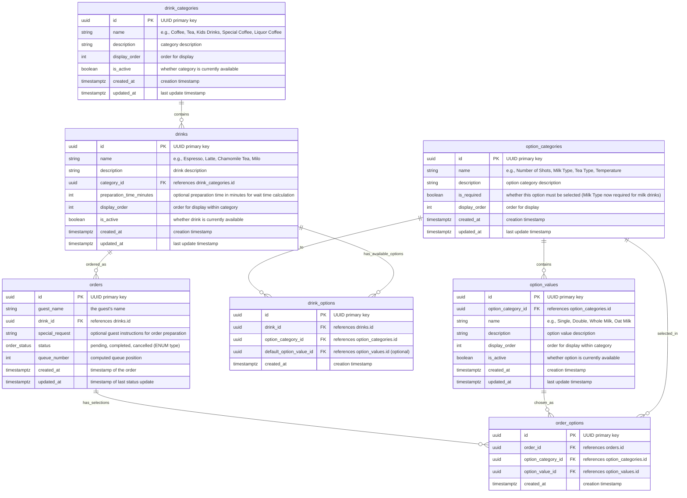

# Database Schema

This document describes the database schema for the Uy, Kape! coffee ordering application using Supabase.

## Database Schema Diagram



## Data Structure (Supabase Tables)

### Database Extensions and Custom Types

The schema uses the following PostgreSQL extensions and custom types:

- **Extension**: `uuid-ossp` for UUID generation
- **Custom ENUM Type**: `order_status` with values: 'pending', 'completed', 'cancelled'

### Tables Overview

### `drink_categories` Table

Organizes drinks into logical categories for better menu management.

| Column        | Type         | Description                                                    |
|---------------|--------------|----------------------------------------------------------------|
| id            | UUID         | UUID primary key (generated with uuid_generate_v4())          |
| name          | TEXT         | e.g., "Coffee", "Tea", "Kids Drinks", "Special Coffee", etc.  |
| description   | TEXT         | category description                                           |
| display_order | INTEGER      | order for display in the menu                                 |
| is_active     | BOOLEAN      | whether category is currently available (default: true)       |
| created_at    | TIMESTAMPTZ  | creation timestamp (default: now())                          |
| updated_at    | TIMESTAMPTZ  | last update timestamp (auto-updated by trigger)              |

**Constraints:**

- UNIQUE constraint on `name`
- Row Level Security enabled with policies for all CRUD operations

### `drinks` Table

Stores all available menu items with category relationships.

| Column                  | Type         | Description                                           |
|-------------------------|--------------|-------------------------------------------------------|
| id                      | UUID         | UUID primary key (generated with uuid_generate_v4()) |
| name                    | TEXT         | e.g., "Espresso", "Latte", "Chamomile Tea", "Milo"   |
| description             | TEXT         | drink description                                     |
| category_id             | UUID         | Foreign Key to drink_categories.id                   |
| preparation_time_minutes| INTEGER      | Optional preparation time in minutes for wait time calculation |
| display_order           | INTEGER      | order for display within category                    |
| is_active               | BOOLEAN      | whether drink is currently available (default: true) |
| created_at              | TIMESTAMPTZ  | creation timestamp (default: now())                  |
| updated_at              | TIMESTAMPTZ  | last update timestamp (auto-updated by trigger)      |

**Constraints:**

- UNIQUE constraint on `(category_id, name)`
- Foreign key constraint on `category_id` with RESTRICT on delete
- Row Level Security enabled with policies for all CRUD operations

### `option_categories` Table

Defines the types of options available (e.g., "Number of Shots", "Milk Type", "Temperature").

| Column        | Type         | Description                                          |
|---------------|--------------|------------------------------------------------------|
| id            | UUID         | UUID primary key (generated with uuid_generate_v4()) |
| name          | TEXT         | e.g., "Number of Shots", "Milk Type"                 |
| description   | TEXT         | option category description                          |
| is_required   | BOOLEAN      | whether this option must be selected (default: false) |
| display_order | INTEGER      | order for display                                    |
| created_at    | TIMESTAMPTZ  | creation timestamp (default: now())                  |
| updated_at    | TIMESTAMPTZ  | last update timestamp (auto-updated by trigger)      |

**Constraints:**

- UNIQUE constraint on `name`
- Row Level Security enabled with policies for all CRUD operations

### `option_values` Table

Stores the specific values for each option category.

| Column             | Type         | Description                                     |
|--------------------|--------------|-------------------------------------------------|
| id                 | UUID         | UUID primary key (generated with uuid_generate_v4()) |
| option_category_id | UUID         | Foreign Key to option_categories.id            |
| name               | TEXT         | e.g., "Single", "Double", "Whole Milk"         |
| description        | TEXT         | option value description                        |
| display_order      | INTEGER      | order for display within category              |
| is_active          | BOOLEAN      | whether option is currently available (default: true) |
| created_at         | TIMESTAMPTZ  | creation timestamp (default: now())            |
| updated_at         | TIMESTAMPTZ  | last update timestamp (auto-updated by trigger) |

**Constraints:**

- UNIQUE constraint on `(option_category_id, name)`
- Foreign key constraint on `option_category_id` with CASCADE on delete
- Row Level Security enabled with policies for all CRUD operations

### `drink_options` Table

Links drinks to their available option categories.

| Column                  | Type         | Description                                           |
|-------------------------|--------------|-------------------------------------------------------|
| id                      | UUID         | UUID primary key (generated with uuid_generate_v4()) |
| drink_id                | UUID         | Foreign Key to drinks.id                              |
| option_category_id      | UUID         | Foreign Key to option_categories.id                  |
| default_option_value_id | UUID         | Foreign Key to option_values.id (optional default)   |
| created_at              | TIMESTAMPTZ  | creation timestamp (default: now())                  |

**Constraints:**

- UNIQUE constraint on `(drink_id, option_category_id)`
- Foreign key constraint on `drink_id` with CASCADE on delete
- Foreign key constraint on `option_category_id` with CASCADE on delete
- Foreign key constraint on `default_option_value_id` with SET NULL on delete
- Row Level Security enabled with policies for all CRUD operations

### `orders` Table

Stores all guest orders with status tracking and queue management.

| Column         | Type          | Description                                        |
|----------------|---------------|----------------------------------------------------|
| id             | UUID          | UUID primary key (generated with uuid_generate_v4()) |
| guest_name     | TEXT          | the guest's name                                   |
| drink_id       | UUID          | Foreign Key to drinks.id                           |
| special_request| TEXT          | optional guest instructions for order preparation |
| status         | order_status  | "pending", "completed", "cancelled" (ENUM type)   |
| queue_number   | INTEGER       | computed queue position for pending orders        |
| created_at     | TIMESTAMPTZ   | timestamp when order was placed (default: now())  |
| updated_at     | TIMESTAMPTZ   | timestamp when order status was last updated (auto-updated by trigger) |

**Constraints:**

- Foreign key constraint on `drink_id` with RESTRICT on delete
- Row Level Security enabled with policies for INSERT, SELECT, and UPDATE operations

### `order_options` Table

Stores the specific options selected for each order.

| Column             | Type         | Description                                 |
|--------------------|--------------|---------------------------------------------|
| id                 | UUID         | UUID primary key (generated with uuid_generate_v4()) |
| order_id           | UUID         | Foreign Key to orders.id                    |
| option_category_id | UUID         | Foreign Key to option_categories.id        |
| option_value_id    | UUID         | Foreign Key to option_values.id            |
| created_at         | TIMESTAMPTZ  | creation timestamp (default: now())        |

**Constraints:**

- UNIQUE constraint on `(order_id, option_category_id)`
- Foreign key constraint on `order_id` with CASCADE on delete
- Foreign key constraint on `option_category_id` with RESTRICT on delete
- Foreign key constraint on `option_value_id` with RESTRICT on delete
- Row Level Security enabled with policies for INSERT and SELECT operations

## Example Data Scenarios

### Scenario 1: Espresso Order

- **Drink**: Espresso (Coffee category)
- **Available Options**: Number of Shots (Single/Double). Milk not configurable (implicitly none).
- **Guest Selection**: Double shot
- **Order Record**: Links to Espresso drink + order_options record for "Double" shot

### Scenario 2: Latte Order

- **Drink**: Caffe Latte (Coffee category)
- **Available Options**: Number of Shots (Single/Double) + Milk Type (required, cannot be None) + Temperature (Hot/Cold; default Hot)
- **Guest Selection**: Single shot + Oat milk + Hot
- **Order Record**: 3 order_options records

### Scenario 3: Chinese Tea Order

- **Drink**: Chinese Tea (Tea category)
- **Available Options**: Tea Type (Jasmine/Oolong/Pu-erh/Chamomile) + Temperature (Hot/Cold)
- **Guest Selection**: Jasmine Green Tea + Hot
- **Order Record**: 2 order_options records

### Scenario 4: Kids Drink Order

- **Drink**: Milo (Kids Drinks category)
- **Available Options**: Temperature (Hot/Cold) (default Hot)
- **Guest Selection**: Hot
- **Order Record**: 1 order_options record

### Scenario 5: Latte Order with Special Request

- **Drink**: Caffe Latte (Coffee category)
- **Available Options**: Number of Shots (Single/Double) + Milk Type (required) + Temperature (Hot/Cold)
- **Guest Selection**: Double shot + Oat milk + Hot
- **Special Request**: "Extra hot please, and light foam"
- **Order Record**: 3 order_options records + special_request field populated

## Updated Option Logic Summary

- Espresso: Shots only
- Espresso Macchiato: Shots + Milk (required) (temperature not currently configured)
- Milk-based lattes/cappuccinos/piccolo: Shots + Milk (required) + Temperature
- Ice-Blended Coffee: Milk (required) + Temperature (default Cold)
- Black Coffee variants & Americano: Temperature only
- Chinese Tea: Tea Type + Temperature
- Kids Drinks (Milo, Babyccino): Temperature only (Babyccino already had temperature; Milo now also has)

## Queue Number Calculation

The `queue_number` field in orders is calculated using a dedicated function:

```sql
CREATE OR REPLACE FUNCTION calculate_queue_number(order_created_at TIMESTAMPTZ)
RETURNS INTEGER AS $$
BEGIN
  RETURN (
    SELECT COUNT(*) + 1
    FROM orders
    WHERE status = 'pending'
      AND created_at < order_created_at
  );
END;
$$ LANGUAGE plpgsql STABLE SECURITY DEFINER;
```

This gives each pending order a position in the queue based on when it was placed.

## Database Views

The schema includes two convenience views for easier querying:

### `drinks_with_categories` View

Provides a joined view of drinks with their category information, showing only active items:

```sql
CREATE VIEW drinks_with_categories AS
SELECT d.id, d.name, d.description, d.display_order, d.is_active,
       dc.name AS category_name, dc.description AS category_description,
       dc.display_order AS category_display_order
FROM drinks d
JOIN drink_categories dc ON d.category_id = dc.id
WHERE d.is_active = true AND dc.is_active = true
ORDER BY dc.display_order, d.display_order;
```

### `orders_with_details` View

Provides a comprehensive view of orders with drink and option information:

```sql
CREATE VIEW orders_with_details AS
SELECT o.id, o.guest_name, o.special_request, o.status, o.queue_number,
       o.created_at, o.updated_at, d.name AS drink_name, dc.name AS category_name,
       STRING_AGG(CONCAT(oc.name, ': ', ov.name), ', ' ORDER BY oc.display_order) AS selected_options
FROM orders o
JOIN drinks d ON o.drink_id = d.id
JOIN drink_categories dc ON d.category_id = dc.id
LEFT JOIN order_options oo ON o.id = oo.order_id
LEFT JOIN option_categories oc ON oo.option_category_id = oc.id
LEFT JOIN option_values ov ON oo.option_value_id = ov.id
GROUP BY o.id, o.guest_name, o.special_request, o.status, o.queue_number,
         o.created_at, o.updated_at, d.name, dc.name
ORDER BY o.created_at DESC;
```

## Database Indexes

The schema includes optimized indexes for performance:

- **Drinks**: `category_id`, `is_active`, `(category_id, display_order)`
- **Option Values**: `option_category_id`, `is_active`
- **Drink Options**: `drink_id`, `option_category_id`
- **Orders**: `status`, `created_at`, `queue_number` (for pending orders), `drink_id`
- **Order Options**: `order_id`, `option_category_id`

## Triggers and Functions

### Automatic Timestamp Updates

All tables with `updated_at` columns have triggers that automatically update the timestamp:

```sql
CREATE OR REPLACE FUNCTION update_updated_at_column()
RETURNS TRIGGER AS $$
BEGIN
  NEW.updated_at = now();
  RETURN NEW;
END;
$$ LANGUAGE plpgsql SECURITY DEFINER;
```

### Row Level Security (RLS)

All tables have Row Level Security enabled with policies that:

- Allow all users to read menu data (`SELECT`)
- Allow all users to insert orders and order options (`INSERT`)
- Allow all users to update orders (`UPDATE`)
- Allow all users to manage menu items (full CRUD operations)

*Note: In a production environment, these policies should be more restrictive with proper authentication and authorization.*

## Notes

- **UUID Primary Keys**: All tables use UUID primary keys generated with `uuid_generate_v4()` for better scalability and security
- **Timestamp Tracking**: All tables include `created_at` and `updated_at` timestamps with automatic trigger-based updates
- **Data Integrity**: Comprehensive foreign key constraints with appropriate cascade/restrict behaviors
- **Performance Optimization**: Strategic indexes on commonly queried columns and combinations
- **Flexible Design**: The schema supports flexible option management for future extensibility
- **Menu Management**: Display order fields enable custom menu organization
- **Soft Deletes**: Active/inactive flags allow temporary menu changes without data deletion
- **Queue Management**: Queue numbers are calculated dynamically to handle order cancellations gracefully
- **Security**: Row Level Security (RLS) enabled on all tables with appropriate policies
- **Views**: Convenience views for common queries reduce application complexity
- **ENUM Types**: Custom PostgreSQL ENUM for order status ensures data consistency
