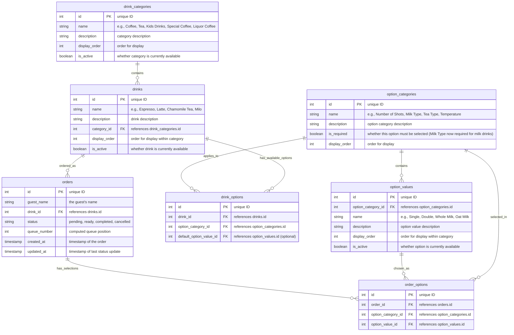

# Database Schema

This document describes the database schema for the Uy, Kape! coffee ordering application using Supabase.

## Database Schema Diagram



## Data Structure (Supabase Tables)

### `drink_categories` Table

Organizes drinks into logical categories for better menu management.

| Column        | Type    | Description                                                    |
|---------------|---------|----------------------------------------------------------------|
| id            | int     | unique ID (Primary Key)                                        |
| name          | string  | e.g., "Coffee", "Tea", "Kids Drinks", "Special Coffee", etc.  |
| description   | string  | category description                                           |
| display_order | int     | order for display in the menu                                 |
| is_active     | boolean | whether category is currently available                        |

### `drinks` Table

Stores all available menu items with category relationships.

| Column        | Type    | Description                                           |
|---------------|---------|-------------------------------------------------------|
| id            | int     | unique ID (Primary Key)                               |
| name          | string  | e.g., "Espresso", "Latte", "Chamomile Tea", "Milo"   |
| description   | string  | drink description                                     |
| category_id   | int     | Foreign Key to drink_categories.id                   |
| display_order | int     | order for display within category                    |
| is_active     | boolean | whether drink is currently available                  |

### `option_categories` Table

Defines the types of options available (e.g., "Number of Shots", "Milk Type", "Temperature").

| Column       | Type    | Description                                  |
|--------------|---------|----------------------------------------------|
| id           | int     | unique ID (Primary Key)                      |
| name         | string  | e.g., "Number of Shots", "Milk Type"         |
| description  | string  | option category description                  |
| is_required  | boolean | whether this option must be selected (Milk Type is required for milk-based drinks) |
| display_order| int     | order for display                           |

### `option_values` Table

Stores the specific values for each option category.

| Column             | Type    | Description                                     |
|--------------------|---------|-------------------------------------------------|
| id                 | int     | unique ID (Primary Key)                         |
| option_category_id | int     | Foreign Key to option_categories.id            |
| name               | string  | e.g., "Single", "Double", "Whole Milk"         |
| description        | string  | option value description                        |
| display_order      | int     | order for display within category              |
| is_active          | boolean | whether option is currently available          |

### `drink_options` Table

Links drinks to their available option categories.

| Column                  | Type | Description                                           |
|-------------------------|------|-------------------------------------------------------|
| id                      | int  | unique ID (Primary Key)                               |
| drink_id                | int  | Foreign Key to drinks.id                              |
| option_category_id      | int  | Foreign Key to option_categories.id                  |
| default_option_value_id | int  | Foreign Key to option_values.id (optional default)   |

### `orders` Table

Stores all guest orders with status tracking and queue management.

| Column       | Type      | Description                                        |
|--------------|-----------|----------------------------------------------------|
| id           | int       | unique ID (Primary Key)                            |
| guest_name   | string    | the guest's name                                   |
| drink_id     | int       | Foreign Key to drinks.id                           |
| status       | string    | "pending", "ready", "completed", "cancelled"      |
| queue_number | int       | computed queue position for pending orders        |
| created_at   | timestamp | timestamp when order was placed                    |
| updated_at   | timestamp | timestamp when order status was last updated      |

### `order_options` Table

Stores the specific options selected for each order.

| Column             | Type | Description                                 |
|--------------------|------|---------------------------------------------|
| id                 | int  | unique ID (Primary Key)                     |
| order_id           | int  | Foreign Key to orders.id                    |
| option_category_id | int  | Foreign Key to option_categories.id        |
| option_value_id    | int  | Foreign Key to option_values.id            |

## Example Data Scenarios

### Scenario 1: Espresso Order

- **Drink**: Espresso (Coffee category)
- **Available Options**: Number of Shots (Single/Double). Milk not configurable (implicitly none).
- **Guest Selection**: Double shot
- **Order Record**: Links to Espresso drink + order_options record for "Double" shot

### Scenario 2: Latte Order

- **Drink**: Caffe Latte (Coffee category)
- **Available Options**: Number of Shots (Single/Double) + Milk Type (required, cannot be None) + Temperature (Hot/Cold; default Hot)
- **Guest Selection**: Single shot + Oat milk + Hot
- **Order Record**: 3 order_options records

### Scenario 3: Chinese Tea Order

- **Drink**: Chinese Tea (Tea category)
- **Available Options**: Tea Type (Jasmine/Oolong/Pu-erh/Chamomile) + Temperature (Hot/Cold)
- **Guest Selection**: Jasmine Green Tea + Hot
- **Order Record**: 2 order_options records

### Scenario 4: Kids Drink Order

- **Drink**: Milo (Kids Drinks category)
- **Available Options**: Temperature (Hot/Cold) (default Hot)
- **Guest Selection**: Hot
- **Order Record**: 1 order_options record

## Updated Option Logic Summary

- Espresso: Shots only
- Espresso Macchiato: Shots + Milk (required) (temperature not currently configured)
- Milk-based lattes/cappuccinos/piccolo: Shots + Milk (required) + Temperature
- Ice-Blended Coffee: Milk (required) + Temperature (default Cold)
- Black Coffee variants & Americano: Temperature only
- Chinese Tea: Tea Type + Temperature
- Kids Drinks (Milo, Babyccino): Temperature only (Babyccino already had temperature; Milo now also has)

## Queue Number Calculation

The `queue_number` field in orders is calculated as:

```sql
SELECT COUNT(*) + 1 
FROM orders 
WHERE status = 'pending' 
AND created_at < [current_order_created_at]
```

This gives each pending order a position in the queue based on when it was placed.

## Notes

- The schema supports flexible option management for future extensibility
- Display order fields enable custom menu organization
- Active/inactive flags allow temporary menu changes without data deletion
- Queue numbers are calculated dynamically to handle order cancellations gracefully
