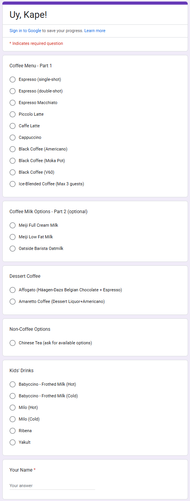

# ☕ Home Free Coffee Ordering System

## Project Overview

A simple, free coffee ordering system for home guests. This application will be a two-part system: a guest-facing module for placing orders and a barista admin module for managing the menu and viewing incoming orders in real-time. The core principle of this project is to use a "vibe coding" approach, leveraging natural language prompts to rapidly prototype components and functionality.

---

## Technology Stack

- **Frontend:** React.js
- **Programming Language:** Typescript
- **Build Tool:** Vite (for a fast development experience)
- **Styling:** Utility-first CSS (e.g., Tailwind CSS)
- **Database:** Supabase (for a completely free, real-time, NoSQL-like database)
- **Hosting:** Vercel (for free and easy front-end hosting)

---

## Specifications

### Main welcome page

A mobile responsive welcome landing page showing the "Uy, Kape!" coffee welcome.
It has 2 links:
1. A main "Order Here" for guests, this leads to the [Guest Module](#guest-module) 
2. A small "Barista administration" link for the Barista, this leads to the [Barista Admin Module](#barista-admin-module) 

### Guest Module

**User Interface:**  
- A password-protected page. The password is retrieved from the application config file, with key "guest-password".
- A mobile responsive intuitive page for a person to choose a drink, select options, enter their name, and place an order.
- This page should have modern look and feel to it, it should be a big improvement to the .

**Functionality:**
1. **Name Input:**  
   A text field for the guest to enter their name.

2. **Drink Selection:**  
   A list of available drinks (fetched from Supabase's `drinks` table). The user should be able to select only one.

3. **Drink Options:**
   Some drink will have options, for example:
   - single or double shot
   - whole, low-fat, non-fat or oat milk.

5. **Order Submission:**  
   A "Place Order" button that, when clicked, saves the order to Supabase's `orders` table.

4. **Confirmation:**  
   A simple, on-screen confirmation message that appears after the order is submitted.
   The confirmation should include:
   - A thank you message, e.g. "Thank you! Your order has been placed"
   - A queue number to indicate how many pending orders before the guests's order (this can be computed based on the # of orders in "pending" status that is less than this items order id)
   - A button to refresh the page (to update the queue number) or to cancel the order

### Barista Admin Module

**User Interface:**  
- A password-protected page. The password is retrieved from the application config file, with key "admin-password".
- A mobile responsive intuitive page for a barista to work with each of the admin functionalities.
- This page should have modern look and feel to it.

**Functionality:**
1. **Menu Management:**  
   A mobile responsive form or list to add, edit, and delete available coffee drinks. The data is saved to the `drinks` table in Supabase.
   This includes the available options for each coffee drink, for example:
   - Espresso will have # of shots (single or double)
   - Cappucino will have # of shots (single or double) and also the choice of milk (whole, low-fat, non-fat, oat)
    
2. **Order Dashboard:**  
   A mobile responsive real-time dashboard that displays all pending guest orders. This includes
   - Order queue: A queue/list of orders which includes the details: drink, drink options, special request, name of the guest
   - Order status: A button or toggle next to each order to mark it as "Ready", "Completed", or "Cancelled". This action should update the order's status in Supabase.
   - Clear orders: A button to cancel all pending orders from the `orders` table, allowing for a fresh start each day.

   Keep it simple. This is a home coffee ordering system for guests. Nothing about money as everything is free. No data analytic features needed.